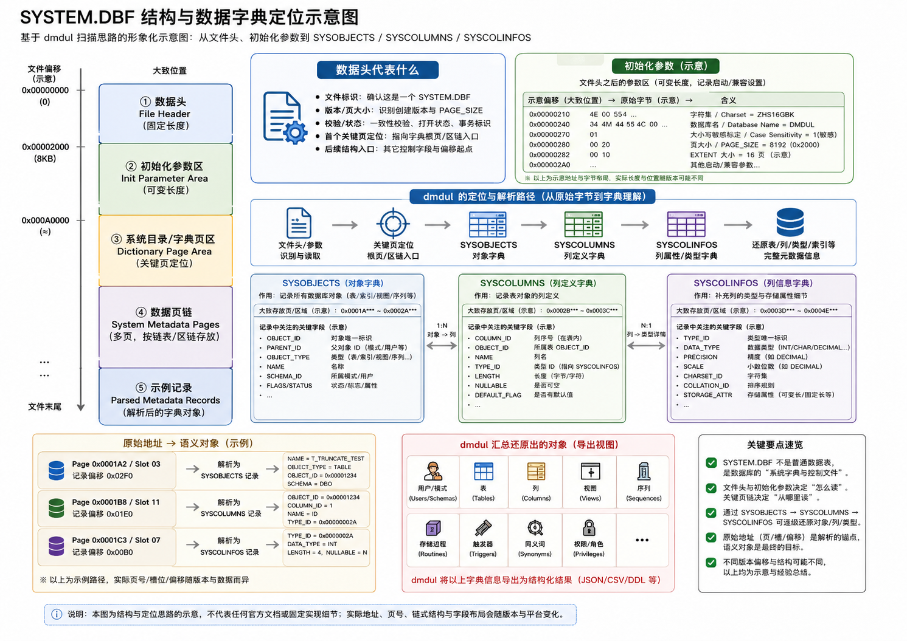
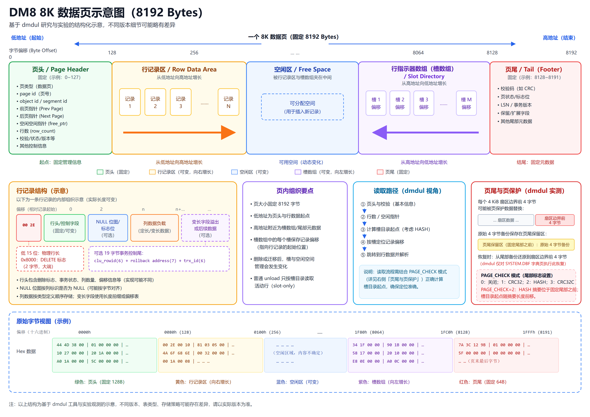

# dmdul

<p align="center">
  
</p>

**Dameng Database Offline Recovery & Data Unloader**

**达梦数据库离线恢复与数据抽取工具**

`dmdul` 是一个使用 Go 编写的达梦数据库离线恢复与数据抽取工具。当数据库无法正常
`open`、无法通过常规恢复流程启动时，它可以直接读取 `SYSTEM.DBF`、可选的 `dm.ctl`
以及用户表空间 DBF 文件：

- 恢复数据库对象定义和用户字典；
- 导出表结构及相关对象 DDL；
- 导出 SQL、CSV 或达梦 DMP 数据；
- 尝试恢复 `DELETE` / `DROP` / `TRUNCATE` 后尚未被覆盖的残留数据；
- 处理大表、分区表、行外 LOB 和 `STORAGE(USING LONG ROW)` 场景。

**v0.5.5 主题：Logical Export Engine**


> `dmdul` 不是常规备份恢复工具，也不能替代 DMRMAN、归档恢复、闪回、`dexp`
> 或专业数据恢复流程。它更适合作为极端故障场景下的最后手段。所有导出的 DDL
> 和数据都必须先在隔离测试库验证。

------

## 项目定位

当前能力链已经覆盖从离线物理文件到官方导入工具的完整路径：

```text
SYSTEM.DBF / dm.ctl / user tablespace DBF
                    |
                    v
            Standard Bootstrap
                    |
                    v
           Dictionary Recovery
                    |
          +---------+---------+---------+
          |         |         |         |
          v         v         v         v
         DDL       SQL       CSV       DMP
                                        |
                                        v
                                      dimp
                                        |
                                        v
                                Dameng Database
```

它更接近“离线字典恢复 + DUL + 原生逻辑 DMP 输出”的组合工具，而不再只是一个
生成 `INSERT` 语句的简单抽取程序。DMP 采用达梦 `FULL / OWNER / SCHEMAS / TABLES`
逻辑级别，在同一个文件中保存可恢复的对象元数据和表数据；配套 SQL DDL 继续保留，
用于审查、人工修订和无法由 DMP 覆盖时的兜底恢复。

------

## 存储结构理解

下面两张示意图概括了 `dmdul` 当前采用的结构理解：第一张从 `SYSTEM.DBF` 文件布局出发，
说明初始化参数、系统字典页以及 `SYSOBJECTS`、`SYSCOLUMNS`、`SYSCOLINFOS` 之间的关系；
第二张进一步展示典型 8K 数据页中页头、行记录、空闲区、槽目录和页尾的组织方式。

### SYSTEM.DBF 与系统字典



这条链路解释了 `dmdul` 如何从原始文件和关键页入口定位系统字典，并逐步还原用户、表、
列、类型、索引等结构化元数据。

### DM8 8K 数据页布局



行记录从低地址方向增长，槽目录通常从高地址方向增长；`dmdul` 读取页头和槽目录后，
按记录偏移定位行数据并依据列定义完成解析。

> **说明：** 两图基于 `dmdul` 的研究与实验观察，用于帮助理解解析思路，并非达梦官方格式文档。
> 不同数据库版本、表类型和存储策略的实际字段布局可能存在差异，请以目标文件的解析结果为准。

------

## 核心能力

- **Standard Bootstrap**：通过 page 0 anchor 进入 `SYSOBJECTS` / `SYSINDEXES`，再按
  storage root、内部页引用和 leaf chain 下载核心系统字典；第二阶段包含
  `SYSOBJINFOS` 分区键和 `SYSHPARTTABLEINFO` 分区明细，失败时回退按页流式扫描。
- **数据库参数恢复**：识别页大小、簇大小、页数、字符集、大小写敏感标志和实例名，
  结合可选 `dm.ctl` 恢复数据库名，并持久化到 `init.dul`。
- **磁盘字典**：生成可人工审查和修改的 `dmdul_dict/*.tsv`，再次启动后可直接
  `load dictionary;`，无需重复 bootstrap；用户与模式归属、分区键、分区顺序和完整
  二进制边界值也会落盘。
  重新 bootstrap 时先在临时目录生成并校验完整字典，再切换目录；旧字典自动备份。
- **对象恢复**：恢复用户、角色授权、表、字段、索引、约束、注释、分区、视图、
  序列、过程、函数、包、包体、触发器、同义词和对象授权；序列会沿 `INFO5` 的
  `file/page/slot` 定位器恢复安全的 `LAST_NUMBER`，避免从初始最小值重新发号。
- **分级数据卸载**：SQL/CSV 支持表级、用户级和整库级；DMP 对齐达梦逻辑导出语义，
  支持互斥的 `TABLES`、`OWNER`、`SCHEMAS` 和 `FULL` 四种级别，每次生成一个原生逻辑文件。
- **精确数据页定位**：为选中表及分区按 `storage root -> internal page refs -> leaf chain`
  生成 page plan；计划完整时仅用 `ReadAt` 读取计划页，失败时依次回退到同 group
  `storage_id` 扫描和段范围读取，只有 `recover table` 才执行全文件残留页扫描。
- **用户页原样读取**：页保护边界恢复仅用于 `SYSTEM.DBF` 标准字典下载；普通数据页、LOB
  和 Long Row 页保持磁盘原始字节，避免接近满页时把页尾 slot 项误写到活动行边界。
- **普通行页解析**：按页尾 slot 目录定位活动行，正确解释大端行长状态字、`0x8000`
  DELETE 标志、`n_rec` 滞后和 free-row 链；普通 `unload` 不再扫描无 slot 物理空洞。
- **事务控制尾识别**：解码常见的 19 字节 `clu_rowid + rollback address + trx_id`
  行尾，为后续离线事务状态和 Undo PRE IMAGE 恢复保留结构化入口。
- **页面校验识别**：支持 `PAGE_CHECK=0/1/2/3`，识别 CRC32、页尾 HASH 和 CRC32C；
  HASH 模式下按摘要长度修正 SYSTEM 字典页、分区页和用户数据页的 slot 起点。
- **可诊断数据卸载**：控制台和 `dul.log` 记录 planned pages、direct pages read、
  fallback pages scanned 及具体 fallback reason；残留恢复还会记录源 group/file、
  `storage_id`、页范围、行数和字典/启发式归属，便于核对实际物理读取范围。
- **完整常规类型路径**：支持定长/变长字符与二进制、精确/近似数值、9 位时间戳、
  时区类型、13 种 INTERVAL、ROWID、BFILE、JSON/JSONB，以及国家字符兼容类型。
- **复杂行与大对象**：支持显式 2-bit NULL metadata；未知状态 `10` 会明确拒绝而不进行
  启发式猜测；支持 ALTER TABLE 历史短行、21 字节 LOB locator、行外 CLOB/BLOB 流式读取
  和 Long Row 页链。
- **残留数据救援**：表定义仍可获得时，`recover table` 可尝试读取 DELETE slot、无 slot
  物理行以及 `DROP` / `TRUNCATE` 后尚未覆盖的残留页；孤儿 storage 仅允许单目标表恢复，
  并使用多行一致性校验和显式物理来源证据降低误归属风险。
- **大规模输出**：DBF 按页流式读取；DMP 支持 64 位长度、多 phase、大表及超过
  4 GiB 的输出路径，不需要把整个数据文件或 LOB 一次性读入内存。

格式研究记录：[DM8 DMP 逻辑导出格式实验记录](docs/dmp-format-research.md)

类型支持与实机验证：[DM8 数据类型支持矩阵](docs/data-types.md)

------

## 适用场景

| 场景                   | 说明                                                         |
| ---------------------- | ------------------------------------------------------------ |
| 数据库无法 `open`      | 实例无法正常启动，但 DBF 文件仍可读取                        |
| 常规恢复失败           | 控制文件、ROLL、REDO、归档链路异常，DMRMAN 无法完成恢复      |
| 只剩数据文件           | 仍可尝试从 `SYSTEM.DBF` 和用户表空间文件恢复对象和数据       |
| 部分数据块损坏         | 大部分页仍可读时，可尝试按页扫描恢复                         |
| DROP / TRUNCATE 后救援 | 原数据块未被覆盖时，可尝试残留页恢复                         |
| 需要恢复 DDL           | 可离线导出用户、表、视图、序列、过程、函数、包、触发器、同义词、授权等对象 |

------

## 支持能力概览

| 能力 | 状态 | 说明 |
| --- | --- | --- |
| Standard Bootstrap | ✅ 支持 | 两阶段字典下载、结构化日志、流式 fallback |
| `SYSTEM.DBF` 参数解析 | ✅ 支持 | extent/page/page count、字符集、大小写标志、open history 实例名 |
| `dm.ctl` / DBF 文件识别 | ✅ 支持 | 数据库名、表空间、group/file、数据文件路径 |
| `control.dul` / `init.dul` | ✅ 支持 | 文件清单、参数值、参数来源及重新加载 |
| `dmdul_dict` 磁盘字典 | ✅ 支持 | TSV 落盘、人工修订、原子重建、旧字典备份及再次参与恢复 |
| 用户、角色与授权 | ✅ 支持 | `CREATE USER`、角色授权、对象授权 |
| 表、字段、索引、约束、注释 | ✅ 支持 | 普通表、堆表、树表、临时表及相关 DDL |
| 分区表 | ✅ 支持 | RANGE / LIST / HASH DDL 与数据导出；分区键和 HIGH_VALUE 可持久化 |
| 视图、序列、过程、函数、包 | ✅ 支持 | `CREATE OR REPLACE` 源码恢复 |
| 触发器与同义词 | ✅ 支持 | 表触发器、模式同义词及授权 |
| 数据导出 | ✅ 支持 | SQL/CSV 表级、用户级、整库级；DMP 另支持模式级 |
| SQL | ✅ 支持 | `INSERT INTO` 数据 SQL，默认格式 |
| CSV | ✅ 支持 | 每张非空表一个 CSV 文件 |
| DMP | ✅ 支持 | 原生逻辑 DMP，包含对象元数据与数据，可通过 `dimp` 导入 |
| 分区表 DMP | ✅ 支持 | 导出父表数据，导入时由 DM 按分区键路由 |
| 行外 CLOB/BLOB | ✅ 支持 | 从活动行 locator 出发按 `0x20` 页链流式输出 |
| Long Row | ✅ 初步支持 | 21 字节 locator 与 `0x22` Long Row 页链 |
| ALTER TABLE 历史行 | ✅ 支持 | 新增尾列的旧行按当前结构补 `NULL` |
| 普通行 slot 与删除标志 | ✅ 支持 | 大端行长低 15 位、`0x8000` DELETE、`n_rec` 滞后 |
| 19 字节事务控制尾 | ✅ 结构已识别 | `clu_rowid`、rollback file/page/offset、48 位 `trx_id` |
| PAGE_CHECK | ✅ 支持 | 0/CRC32/HASH/CRC32C；HASH 页 slot 目录自动前移 |
| DELETE / DROP / TRUNCATE 残留页 | ✅ 初步支持 | 仅由 `recover table` 扫描，且要求原页尚未覆盖 |
| 基础类型与 NULL metadata | ✅ 支持 | 2-bit NULL、数值、二进制、9 位时间戳、时区、13 种 INTERVAL、ROWID |
| JSON / JSONB / BFILE | ✅ 支持 | JSONB 标量与复合结构、BFILE locator；详见类型支持矩阵 |

------

## Data Export / 数据导出能力

### Data Export Formats

dmdul supports three offline data export formats / dmdul 支持三种离线数据导出格式：

| Format | Description | Default |
| --- | --- | --- |
| SQL | Generate `INSERT INTO` SQL statements | ✅ Default |
| CSV | Generate one CSV data file per non-empty table | Optional |
| DMP | Generate self-describing Dameng logical dump files | Optional |

配置导出格式：

```text
DMDUL> set data_format sql;
DMDUL> set data_format csv;
DMDUL> set data_format dmp;
```

### SQL Export

SQL 是默认格式，适合直接审查、修改和小规模恢复：

```text
DMDUL> unload table HR_TEST.EMP_INFO;
```

输出：

```text
output/
├── HR_TEST_EMP_INFO_ddl.sql
└── HR_TEST_EMP_INFO_data.sql
```

### CSV Export

CSV 适合数据分析、人工检查或作为中间迁移格式。用户级导出会按表生成文件，空表不生成
空 CSV：

```text
DMDUL> set data_format csv;
DMDUL> unload user HR_TEST;
```

输出示例：

```text
output/
├── HR_TEST_EMP_INFO_ddl.sql
├── HR_TEST_EMP_INFO_data.csv
├── HR_TEST_ORDER_ddl.sql
└── HR_TEST_ORDER_data.csv
```

### Dameng DMP Export

dmdul 可以生成由达梦官方 `dimp` 识别和装载的原生逻辑 DMP。一个文件同时包含所选范围内
可恢复的对象定义、授权和表数据；配套 `_ddl.sql` 是便于审计和人工修订的副本，不是正常
`dimp` 导入前必须执行的脚本。

```text
DMDUL> set data_format dmp;
DMDUL> unload table HR_TEST.EMP_INFO;
DMDUL> unload user HR_TEST;
DMDUL> unload schema HR_TEST;
DMDUL> unload database;
```

DMP 能力：

- 与达梦 `FULL / OWNER / SCHEMAS / TABLES` 四种互斥逻辑级别对应；
- 单文件包含用户、表、索引、约束、注释、视图、序列、过程/函数/包、触发器、
  同义词、角色和对象授权等当前可恢复元数据；
- `OWNER` 会包含所选用户拥有的全部模式，`SCHEMAS` 只包含明确选择的模式；
- 空表仍保留建表元数据，不会因没有行而从 DMP 中消失；
- 支持 UTF-8、GB18030、EUC-KR 文件头；
- 支持 RANGE / LIST / HASH 分区表数据；
- 支持行外 CLOB/BLOB locator 页链流式读取；
- 支持 `STORAGE(USING LONG ROW)` 数据路径；
- 使用 64 位长字段长度，支持超大 LOB；
- 支持多 phase 输出、大表和超过 4 GiB 的 dump 路径；
- 自动写入 page size、extent size、字符集和 `CASE_SENSITIVE` 标志。

各级命令的 DMP 输出规则：

| Mode | Command | Default output |
| --- | --- | --- |
| TABLES | `unload table HR_TEST.EMP_INFO;` | `output/HR_TEST_EMP_INFO.dmp` |
| OWNER | `unload user HR_TEST;` | `output/HR_TEST.dmp` |
| SCHEMAS | `unload schema HR_TEST,ARCHIVE;` | `output/SCHEMAS_HR_TEST_ARCHIVE.dmp` |
| FULL | `unload database;` | `output/DATABASE.dmp` |

TABLES、OWNER 和 SCHEMAS 都支持用逗号选择多个对象，也可用 `to <prefix>` 指定文件前缀。
四种级别由对应命令决定，不会在同一次导出中混用。当前 TABLES 导出以完整父表为单位，
暂不支持只选择单个叶子分区。

分区表行为：

```text
partitioned table
       |
       +-- dmdul export
              |
              +-- parent-table logical DMP
                          |
                          +-- dimp imports rows
                                   |
                                   +-- DM routes rows by partition key
```

建议先查看内容并校验，再由 `dimp` 一次恢复元数据和数据：

```bash
dimp SYSDBA/password FILE=HR_TEST_EMP_INFO.dmp SHOW=Y NOLOGFILE=Y
dimp SYSDBA/password FILE=HR_TEST_EMP_INFO.dmp CTRL_INFO=4 NOLOGFILE=Y
dimp SYSDBA/password \
  FILE=HR_TEST_EMP_INFO.dmp \
  FAST_LOAD=Y
```

当前 DM DMP 行格式不能由已验证通道无损保存 `TIME` 小数秒，遇到非零小数秒时工具会
打印告警。JSON/JSONB 表必须使用 `FAST_LOAD=N` 导入；实测 `FAST_LOAD=Y` 对
dmdul 和官方 `dexp` 文件都会生成不可查询的 JSONB 内容。跨字符集恢复应按目标
字符集重新生成 DMP，不能只修改文件头。

------

## 下载

请从 [Releases](https://github.com/greatfinish/dmdul/releases) 下载最新版本。

| 平台        | 包名                                 |
| ----------- | ------------------------------------ |
| Windows x64 | `dmdul_windows_amd64_<version>.zip`  |
| Linux x64   | `dmdul_linux_amd64_<version>.tar.gz` |

下载后建议校验 Release 页面提供的 SHA256。

Windows：

```powershell
Get-FileHash .\dmdul_windows_amd64_<version>.zip -Algorithm SHA256
```

Linux：

```bash
sha256sum dmdul_linux_amd64_<version>.tar.gz
```

查看版本：

```bash
./dmdul version
```

或 Windows：

```powershell
.\dmdul.exe version
```

------

## 快速开始

### 1. 准备离线文件

建议把相关文件放在同一个目录中：

```text
D:\temp\oldpro\
├── SYSTEM.DBF
├── dm.ctl
├── MAIN.DBF
├── ROLL.DBF
├── TEMP.DBF
└── TBS_*.DBF
```

`dm.ctl` 是可选增强文件，但强烈建议提供。没有 `dm.ctl` 时，工具会尝试通过 `control.dul` 和 DBF 页头识别数据文件。

------

### 2. 启动交互式 DUL Shell

Windows：

```powershell
.\dmdul.exe
```

Linux：

```bash
./dmdul
```

示例：

```text
DMDUL> set data_dir D:\temp\oldpro;
DMDUL> set system D:\temp\oldpro\SYSTEM.DBF;
DMDUL> set control D:\temp\oldpro\dm.ctl;
DMDUL> show parameter;
DMDUL> bootstrap;
DMDUL> list user;
DMDUL> list table HR_TEST;
DMDUL> unload object HR_TEST;
DMDUL> set data_format dmp;
DMDUL> unload user HR_TEST;
DMDUL> unload database;
DMDUL> exit;
```

`bootstrap;` 会生成：

```text
control.dul
init.dul
dul.log
dmdul_dict/
```

如果目录中已有 `dmdul_dict`，新的 bootstrap **不会读取旧 TSV 参与扫描**。工具会先在
同级临时目录写出并反向加载校验整套字典，成功后把旧目录保留为
`dmdul_dict.backup-YYYYMMDD-HHMMSS`，再启用新目录。这样旧文件、旧分区明细或旧序列值
不会混进本次结果；bootstrap 失败时，旧内存字典也不会继续被 unload 静默使用。
备份目录不会被自动加载；确认新字典正确后，可以自行归档或删除旧备份。

首次执行 `unload` 或 `recover` 时，会在启动 DMDUL 的当前目录创建 `output/`，所有 DDL、
SQL、CSV 和 DMP 都集中写入其中。该默认目录不跟随 `data_dir`：

```text
D:\OneDrive\learn\dmdul\
└── output\
    ├── HR_TEST_EMP_INFO_ddl.sql
    └── HR_TEST_EMP_INFO.dmp
```

可以通过 `set output_dir <directory>;` 显式指定其他卸载目录；该参数只改变
`unload` / `recover` 产物位置，不移动 `dmdul_dict`、`control.dul`、`init.dul` 或
`dul.log`。

其中 `init.dul` 保存 bootstrap 识别出的 `db_name`、`instance_name`、
`extent_size`、`page_size`、`unicode_flag` 和 `case_sensitive_value` 及其来源；
`show parameter;` 可查看，`load parameter;` 可重新加载。

`unload database;` 默认生成：

```text
output/DATABASE_ddl.sql
output/DATABASE_data.sql
```

设置 `data_format=dmp` 后，生成可审查的 `output/DATABASE_ddl.sql` 和一个同时包含
对象元数据、空表定义及全部可恢复数据的 `output/DATABASE.dmp`。
`case_sensitive=auto` 会从 `SYSTEM.DBF` 第 4 页偏移 `0x2C` 读取建库标志并写入
DMP 文件头，避免 `dimp` 因大小写敏感参数不一致等待人工确认。

------

## 推荐恢复流程

```text
准备 SYSTEM.DBF、dm.ctl、用户表空间 DBF
        |
        v
启动 dmdul
        |
        v
set data_dir
        |
        v
set system / set control / show parameter
        |
        v
bootstrap
        |
        v
检查 dmdul_dict
        |
        v
必要时人工修正 users.tsv / tables.tsv / columns.tsv / partitions.tsv / partition_keys.tsv 等
        |
        v
load dictionary
        |
        v
unload object / table / user / database
        |
        +----------------+----------------+----------------+
        |                |                |                |
        v                v                v                v
      DDL SQL        INSERT SQL          CSV             DMP
        |                |                |                |
        +----------------+----------------+                v
                         |                               dimp
                         +---------------+----------------+
                                         |
                                         v
                                  隔离测试库验证
```

详细流程见：[离线恢复流程](https://github.com/greatfinish/dmdul/blob/main/docs/recovery-workflow.md)。

------

## dmdul_dict 字典目录

`bootstrap;` 会在工作目录生成 `dmdul_dict`。这些 TSV 文件可以人工修正，修正后执行：

```text
DMDUL> load dictionary;
```

后续 `unload table`、`unload object`、`unload user`、`unload schema`、`unload database`
会优先使用文本字典中的修正结果。

### 推荐交互顺序

需要从当前 DBF 重新建立字典时：

```text
DMDUL> set data_dir D:\recovery\dameng;
DMDUL> set system D:\recovery\dameng\SYSTEM.DBF;
DMDUL> set control D:\recovery\dameng\dm.ctl;
DMDUL> show parameter;
DMDUL> bootstrap;
DMDUL> list user;
DMDUL> list table HR_TEST;
```

人工检查或修订本次生成的 TSV 后，再执行：

```text
DMDUL> load dictionary;
DMDUL> unload object HR_TEST;
DMDUL> unload user HR_TEST;
```

如果明确要复用以前已经审核过的字典，则跳过 `bootstrap;`，设置对应 `data_dir` 后直接
`load dictionary;`。不要在准备重新扫描时先执行 `list` 或 `unload`，因为字典尚未加载时
这些命令会尝试自动读取当前目录已有的 `dmdul_dict`。修改 `system`、`control`、`data_dir`
或 `charset` 后，当前内存字典会失效，必须重新 bootstrap 或显式 load。
自动加载还会核对当前 SYSTEM 路径、页大小和页数；不匹配时会拒绝 unload。只有在人工确认
字典与数据文件确实对应时，才应使用显式 `load dictionary;`。

| 文件            | 说明                                       |
| --------------- | ------------------------------------------ |
| `meta.tsv`      | SYSTEM.DBF、bootstrap 模式、页大小、字符集、大小写标志、对象数量等摘要 |
| `users.tsv`     | 用户 / owner 列表                          |
| `schemas.tsv`   | 模式及其所属用户，用于区分 OWNER 与 SCHEMAS |
| `tables.tsv`    | 表摘要、表空间、段信息、storage 信息       |
| `columns.tsv`   | 字段定义、字段类型、长度、默认值、nullable |
| `partitions.tsv` | 分区顺序、类型、名称、子表 ID、完整 `HIGH_VALUE` 二进制值及物理位置 |
| `partition_keys.tsv` | 分区键顺序、字段 ID 和字段名              |
| `views.tsv`     | 视图定义                                   |
| `sequences.tsv` | 序列定义、安全 `last_number` 及运行状态 file/page/slot 证据 |
| `routines.tsv`  | 存储过程、函数、包、包体源码               |
| `triggers.tsv`  | 触发器定义                                 |
| `synonyms.tsv`  | 同义词定义                                 |
| `tab_privs.tsv` | 表、视图、序列等对象授权                   |

`tables.tsv` 中的重要恢复字段：

| 字段           | 说明                       |
| -------------- | -------------------------- |
| `header_file`  | 段头文件号                 |
| `header_block` | 段头块号                   |
| `bytes`        | 段大小                     |
| `blocks`       | 段块数                     |
| `extents`      | extent 数量                |
| `storage_id`   | 主数据 storage / assist id |
| `root_file`    | storage root 文件号        |
| `root_page`    | storage root 页号          |
| `assist_ids`   | 辅助 storage id 列表       |

------

## 表数据定位策略

`dmdul` 当前采用分层定位策略：

```text
1. storage root / internal refs / leaf chain 生成 page plan
2. page plan 完整时，仅用 ReadAt 读取计划页
3. root 无效、leaf 断链或计划页校验失败时，仅扫描同 group 文件并匹配 storage_id
4. storage_id 扫描仍无法定位时，读取 header_file / header_block / blocks 段范围
5. 只有 recover table 恢复模式才扫描全部数据文件中的残留页
```

正常表数据导出不会全面扫描整个数据文件。计划页在导出时再次校验
`group_id/file_id/page_no`、`page_kind=0x14` 和 `storage_id`；精确 page ref 是主定位依据，
段信息只参与辅助校验和后续兜底。

每次 `unload` / `recover` 都会在控制台和 `dul.log` 中记录：

```text
planned pages: 12
direct pages read: 12
fallback pages scanned: 0
fallback reason: none
```

`recover table` 接受残留页后还会输出类似证据：

```text
recovery source: target=USERS1.T_TEST group=4 file=0 storage_id=33555438 pages=3 page_range=32-48 rows_located=20 rows_exported=20 rows_failed=0 attribution=heuristic-orphan
```

其中 `attribution=dictionary` 表示页 storage 可由当前或保存的字典映射；
`attribution=heuristic-orphan` 表示 storage 已不属于活动字典对象，所有结果都必须结合
源页范围、业务字段和隔离库回放再次核验。

当 root 损坏、leaf 链断裂或 TRUNCATE / DROP 后当前字典范围已经变化时，可以使用恢复扫描模式进行兜底救援。

------

## DROP / TRUNCATE 残留页恢复

如果表被 `TRUNCATE` 或 `DROP` 后，原数据块尚未被新写入覆盖，可以尝试：

```text
DMDUL> recover table USERS1.T_TEST;
```

也可以指定输出前缀：

```text
DMDUL> recover table USERS1.T_TEST to users1_t_test_recover;
```

DROP 场景中，当前 `SYSTEM.DBF` 里可能已经没有表定义。此时需要：

1. 加载 DROP 前保存的 `dmdul_dict`；
2. 或人工在 `tables.tsv`、`columns.tsv` 中补齐表结构；
3. 必要时补充 `storage_id`、`root_file`、`root_page`、`assist_ids` 等恢复辅助字段。

孤儿 storage 无法仅靠物理页证明原始 owner/table。`dmdul` 不会在一次恢复中把孤儿页分配给
多个目标表；单表恢复产生的 `heuristic-orphan` 结果也不是确定归属，导入前必须人工复核。

------

## 常用命令

### 交互式命令

```text
bootstrap;
load parameter;
load dictionary;
show parameter;
list user;
list table <owner>;
unload table <owner.table_name>;
unload object <owner|all>;
unload user <owner>;
unload database;
recover table <owner.table_name>;
set data_format sql;
set data_format csv;
set data_format dmp;
set case_sensitive auto;
exit;
```

功能性命令行子命令已经移除。请直接运行 `dmdul` 进入交互界面；`help` 和
`version` 仅用于查看帮助与版本，不执行数据库恢复操作。

------

## 从源码构建

### 环境要求

- Go 1.22+
- Windows / Linux / macOS

克隆并测试：

```bash
git clone https://github.com/greatfinish/dmdul.git
cd dmdul
go test ./...
```

Windows 构建：

```powershell
$ver = git describe --tags --abbrev=0
$commit = git rev-parse --short HEAD
$buildTime = (Get-Date).ToUniversalTime().ToString("yyyy-MM-ddTHH:mm:ssZ")

go build `
  -trimpath `
  -ldflags "-s -w -X dmdul/internal/version.Version=$ver -X dmdul/internal/version.Commit=$commit -X dmdul/internal/version.BuildTime=$buildTime" `
  -o bin\dmdul.exe `
  ./cmd/dmdul
```

Linux x64 交叉编译：

```powershell
$env:CGO_ENABLED="0"
$env:GOOS="linux"
$env:GOARCH="amd64"

go build `
  -trimpath `
  -ldflags "-s -w -X dmdul/internal/version.Version=$ver -X dmdul/internal/version.Commit=$commit -X dmdul/internal/version.BuildTime=$buildTime" `
  -o bin\dmdul_linux_amd64 `
  ./cmd/dmdul

Remove-Item Env:\GOOS
Remove-Item Env:\GOARCH
Remove-Item Env:\CGO_ENABLED
```

Linux 本机编译：

```bash
go test ./...
go build -ldflags "-s -w" -o bin/dmdul ./cmd/dmdul
```

------

## 文档

- [安装方式](https://github.com/greatfinish/dmdul/blob/main/docs/install.md)
- [使用示例](https://github.com/greatfinish/dmdul/blob/main/docs/usage.md)
- [配置和参数说明](https://github.com/greatfinish/dmdul/blob/main/docs/config.md)
- [离线恢复流程](https://github.com/greatfinish/dmdul/blob/main/docs/recovery-workflow.md)
- [本地开发、测试、构建说明](https://github.com/greatfinish/dmdul/blob/main/docs/development.md)
- [版本变更记录](https://github.com/greatfinish/dmdul/blob/main/CHANGELOG.md)
- [DM8 DMP 格式研究记录](https://github.com/greatfinish/dmdul/blob/main/docs/dmp-format-research.md)
- [DM8 普通行页格式与解析边界](https://github.com/greatfinish/dmdul/blob/main/docs/row-page-format.md)
- [DM8 PAGE_CHECK 页校验实验](https://github.com/greatfinish/dmdul/blob/main/docs/page-check.md)
- [逆向扫描笔记](https://github.com/greatfinish/dmdul/blob/main/docs/offline-system-scan.md)
- [系统字典字段笔记](https://github.com/greatfinish/dmdul/blob/main/docs/system-dictionary-fields.md)

------

## 项目目录

```text
cmd/dmdul/          CLI 入口
internal/cli/       命令行参数、交互式 REPL 和输出
internal/dm/        SYSTEM.DBF、dm.ctl、字典、DDL、数据页、LOB 和 DMP 解析/输出
internal/version/   版本信息
docs/               用户文档和研究笔记
research/           临时研究脚本和实验记录
```

------

## 安全提醒

请不要把生产库文件、导出结果或敏感数据提交到公开仓库：

```text
*.DBF
*.dbf
dm.ctl
dm.ini
init.dul
control.dul
dmdul_dict/
output/
dul.log
*.sql
*.csv
*.dmp
真实生产数据
导出的业务数据
```

建议在隔离目录中放置待恢复文件，并把导出的 SQL、CSV、日志都按敏感数据处理。

------

## 当前限制

- 工具只读取离线文件，不会修改原始 DBF 文件。
- 离线恢复结果受达梦版本、页大小、字符集、表类型、行格式和损坏程度影响。
- 导出的 DDL、SQL、CSV 和 DMP 都必须先在隔离测试库验证。
- DROP / TRUNCATE 残留页恢复依赖原数据页是否被覆盖，不能保证一定成功。
- DMP 逻辑容器来自对已验证 DM8 构建的黑盒差分研究；不同 DM8 文件版本仍需先用
  `dimp SHOW=Y`、`CTRL_INFO=4` 和隔离库回灌验证。
- 当前不生成压缩、加密或多文件 DMP，也暂不支持 TABLES 模式只选择单个表分区。
- 已验证的 DMP 通道不能无损保存 `TIME` 小数秒，工具会对发生精度损失的行给出告警。
- 跨字符集 DMP 不应只修改文件头，应按目标字符集重新生成。
- 行外 LOB 和 Long Row 已有流式恢复路径，但损坏页、断链和多版本残留仍在持续验证。
- 迁移行、链式行以及更多版本的复杂物理行格式仍需扩大样例覆盖。
- 普通 `unload` 已是 slot-only，但 slot-only 不等于 committed-only；未提交 INSERT / DELETE
  的最终可见性仍需离线事务状态和完整 Undo PRE IMAGE 链才能准确判断。
- 不保证恢复结果与故障前数据库在事务一致性层面完全一致。

------

## 版本路线

| 版本   | 方向 |
| --- | --- |
| v0.4.1 | Standard Bootstrap、磁盘字典、原生兼容 DMP、参数持久化 |
| v0.5.0 | 完整常规类型矩阵、SQL/CSV/DMP 一致解析、统一 `output/` 输出目录 |
| v0.5.1 | page plan 直读、同 group storage fallback、segment fallback、卸载 I/O 诊断 |
| v0.5.2 | 普通行头与 DELETE slot、slot-only 卸载、19 字节事务尾、PAGE_CHECK 四模式 |
| v0.5.4 | 用户页原样读取、序列/分区修复、字典原子重建与可审计残留恢复 |
| v0.5.5 | FULL/OWNER/SCHEMAS/TABLES 四级原生逻辑 DMP、模式字典与单文件元数据/数据导出 |
| v0.6.x | 迁移行/链式行、损坏页诊断、更多 DM8 版本兼容验证 |
| v1.0.0 | 固化文件格式兼容矩阵、恢复报告和稳定发布流程 |

------

## 贡献

欢迎提交 Issue、测试样例、失败案例和改进建议。

提交 Pull Request 前建议执行：

```bash
go test ./...
```

如果涉及数据导出逻辑，请尽量补充最小化测试样例。

------

## 开源协议

本项目使用 [MIT License](LICENSE)。
